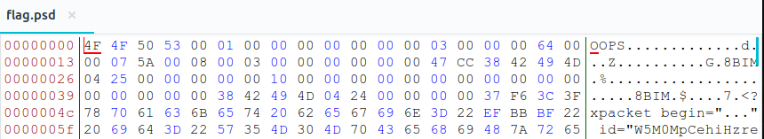
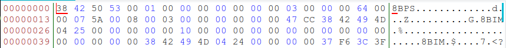
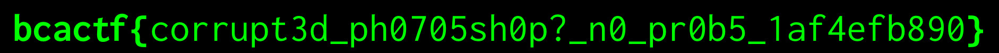

# corrupt-psd
**Category:** forensic  
**Point:** 200

> I wanted to use Photoshop to embiggen my head, but er... something happened. It looks like Photoshop isn't the signature image editing program it used to be.
> 
> Can you help fix this?

file : [flag.psd](https://www.bcactf.com/files/b66687dbdb187055841c38e3239d3341/flag.psd?token=eyJ0ZWFtX2lkIjoxMTE4LCJ1c2VyX2lkIjoxODY2LCJmaWxlX2lkIjozfQ.XRjIfw.VwrQRZ7kJOx4Ms5pt9h3786Qztk)

---

Pada challenge kali ini kita diberikan sebuah file berekstensi `.psd`, namun error ketika dibuka. Saat dicek menggunakan perintah `file` pun tidak mendeteksi jenis file-nya. Hal ini kemungkinan besar pada _file signature_ terdapat kesalahan ataupun tidak ada. Mari kita coba buka menggunakan tools `bless`.

Dari sini kita dapat lihat bahwa file signature untuk file `flag.psd` salah (silahkan cek list [file signature](https://en.wikipedia.org/wiki/List_of_file_signatures)). Untuk itu, ubah bilangan hex-hex awal menjadi **`38 42 50 53`** kemudian simpan dengan nama `output.psd`.

Setelah disimpan, selanjutnya buka menggunakan aplikasi GIMP pada Linux maupun Photoshop pada Windows (Mac saya ga tau hehe).

Dan akhirnya flag-nya ketemu

flag : `bcactf{corrupt3d_ph0705sh0p?_n0_pr0b5_1af4efb890}`

