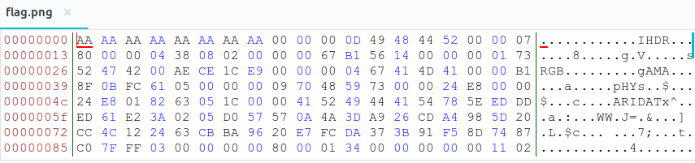
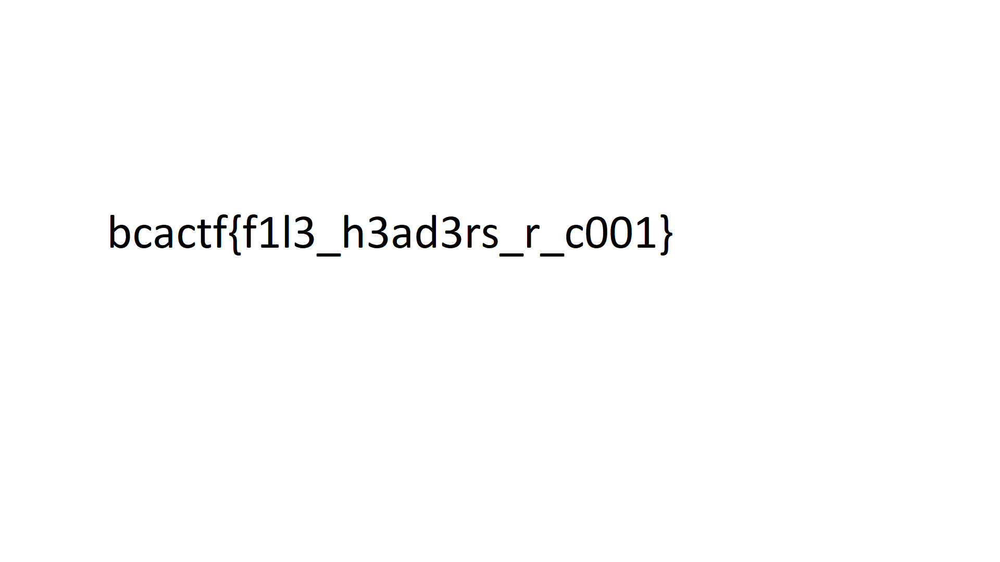

# file-head
**Category:** forensic  
**Point:** 125

> It looks like the PNG file that holds our flag has been corrupted. My computer isn't able to recognize the file type, maybe it has something to do with how the file type is recognized...
> 
> made by: @20nlevin

file : [flag.png](https://www.bcactf.com/files/f4c0dfc272668abade2f993b45274049/flag.png?token=eyJ0ZWFtX2lkIjoxMTE4LCJ1c2VyX2lkIjoxODY2LCJmaWxlX2lkIjo0fQ.XRi0zA.tNvDuekVof-KQivAkabtQUbTIfU)

---

Pada challenge ini kita diberikan sebuah file berekstensi `.png`, namun anehnya ketika dilihat menggunakan perintah `file` yang terbaca file tersebut adalah jenis file `5View Capture File`. Hmm sepertinya ada yang aneh. Mari kita gunakan `bless` untuk melakukan _hex editing_.

Sesuai dengan ketentuan [File Signature](https://en.wikipedia.org/wiki/List_of_file_signatures), file PNG seharusnya diawali dengan hex

<pre>
  <b>89 50 4E 47 0D 0A 1A 0A</b>
</pre>

Maka dari itu, kita ubah hex-hex awal file `flag.png` menjadi sesuai seperti diatas dengan menggunakan tool `bless`, kemudian simpan hasilnya menjadi `output.png` dan buka menggunakan image viewer.

Daaan akhirnya ketemu juga flag-nyaaa!!!

flag : `bcactf{f1l3_h3ad3rs_r_c001}`
