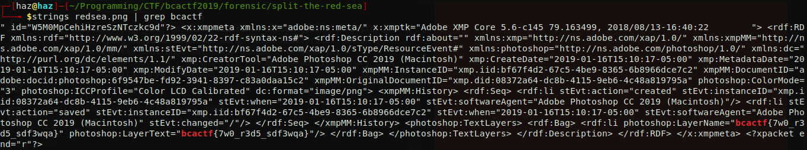

# split-the-red-sea
**Category:** forensic <br>
**Point:** 100

> Moses used a staff to split the Red Sea. What will you use?
> 
> made by: @aidanglickman

file : [redsea.png](https://www.bcactf.com/files/f01ea7651e841ade9b24ff3804dd968e/redsea.png?token=eyJ0ZWFtX2lkIjoxMTE4LCJ1c2VyX2lkIjoxODY2LCJmaWxlX2lkIjo2fQ.XRivWA.tcsHQSH1cV2f-GL4ZtnIojg5sM4)

---


Pada challenge kali ini kita diberikan sebuah gambar berekstensi `.png` yang hanya menampilkan warna merah keseluruhan. Untuk menyelesaikan challenge ini cukup dengan trik umum yaitu menggunakan `strings`. Karena file PNG merupakan file binary maka dari itu kita hanya tampilkan data yang termasuk _string_ saja.

```bash
strings redsea.png | grep bcactf
```



exploit : [script.sh](./script.sh)

flag : `bcactf{7w0_r3d5_sdf3wqa}`