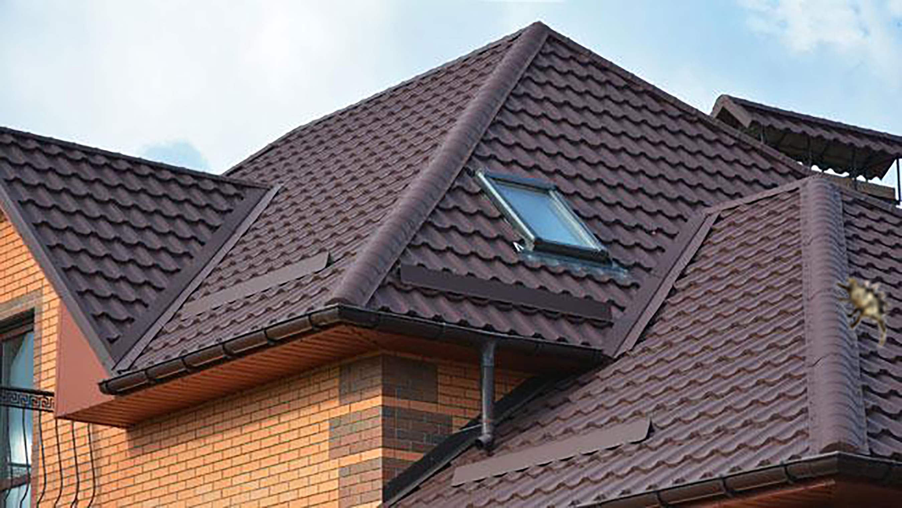
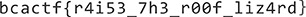

# study-of-roofs
**Category:** forensic <br>
**Point:** 150

> My friend has always gotten in to weird things, and his recent obsession is with roofs. He sent me this picture recently, and said he hid something special in it. Do you think you could help me find it?
> 
> made by: @aidanglickman

file : [dem_shingles.jpg](https://www.bcactf.com/files/2650e2b586cb2fbfdf1088e9b905478b/dem_shingles.jpg?token=eyJ0ZWFtX2lkIjoxMTE4LCJ1c2VyX2lkIjoxODY2LCJmaWxlX2lkIjo3fQ.XRjAXA.i-Zou0Zj8FF7wDHLWG8qt14nwd0)

---



Untuk challenge ini kita disuguhkan dengan 1 buah file JPEG yang hanya menampilkan atap sebuah rumah. Entah kenapa sewaktu saya mencoba men-solve challenge ini saya fokus ke gambar serangga yang terlihat buram di sebelah kanan, padahal ternyata hal itu tidak berpengaruh apa-apa wkwkwkwk.

Untuk mengecek gambar ini apakah terdapat kejanggalan kita gunakan tools `binwalk`

```console
┌─[haz@haz]─[study-of-roofs]
└──╼ $binwalk dem_shingles.jpg

DECIMAL       HEXADECIMAL     DESCRIPTION
--------------------------------------------------------------------------------
0             0x0             JPEG image data, EXIF standard
12            0xC             TIFF image data, big-endian, offset of first image directory: 8
14689         0x3961          Unix path: /www.w3.org/1999/02/22-rdf-syntax-ns#"> <rdf:Description rdf:about="" xmlns:xmpMM="http://ns.adobe.com/xap/1.0/mm/" xmlns:stEvt=
1562983       0x17D967        JPEG image data, EXIF standard
1562995       0x17D973        TIFF image data, big-endian, offset of first image directory: 8
1568937       0x17F0A9        Unix path: /www.w3.org/1999/02/22-rdf-syntax-ns#"> <rdf:Description rdf:about="" xmlns:xmp="http://ns.adobe.com/xap/1.0/" xmlns:xmpMM="http
1573688       0x180338        Copyright string: "Copyright (c) 1998 Hewlett-Packard Company"
```

Dengan tools ini menjadi ketahuan bahwa di gambar ini terdapat sebuah file gambar JPEG lagi. Untuk melakukan ekstraksi kita bisa gunakan `dd` maupun `foremost`. Namun kita gunakan `foremost` saja yang lebih mudah dipakai.

```
┌─[haz@haz]─[study-of-roofs]
└──╼ $foremost -v dem_shingles.jpg
Foremost version 1.5.7 by Jesse Kornblum, Kris Kendall, and Nick Mikus
Audit File

Foremost started at Fri Jun 28 21:09:40 2019
Invocation: foremost -v dem_shingles.jpg 
Output directory: /home/haz/Programming/CTF/bcactf2019/forensic/study-of-roofs/output
Configuration file: /etc/foremost.conf
------------------------------------------------------------------
File: dem_shingles.jpg
Start: Fri Jun 28 21:09:40 2019
Length: 1 MB (1580771 bytes)
 
Num	 Name (bs=512)	       Size	 File Offset	 Comment 

0:	00000000.jpg 	       1 MB 	          0 	 
1:	00003052.jpg 	      17 KB 	    1562983 	 
Finish: Fri Jun 28 21:09:40 2019

2 FILES EXTRACTED
	
jpg:= 2
------------------------------------------------------------------

Foremost finished at Fri Jun 28 21:09:40 2019

┌─[haz@haz]─[study-of-roofs]
└──╼ $cd output/jpg
┌─[haz@haz]─[study-of-roofs]
└──╼ $eog 00003052.jpg
```



Daaan akhirnya kita mendapatkan flag-nya!!!

flag : `bcactf{r4i53_7h3_r00f_liz4rd}`