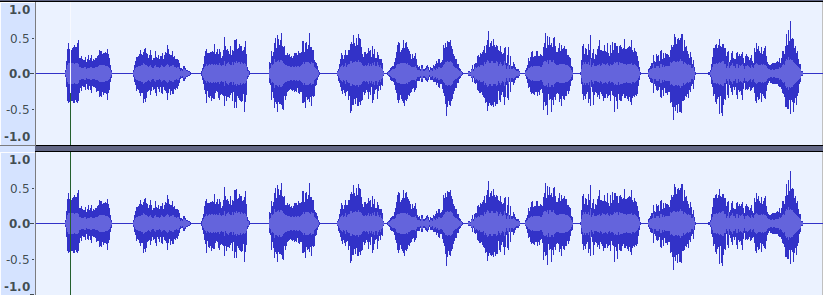
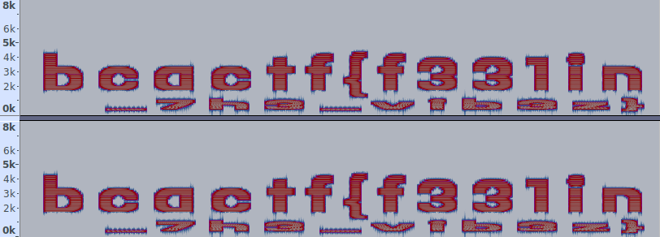

# wavey
**Category:** forensic  
**Point:** 150

> My friend sent me his new mixtape, but honestly I don't think it's that good. Can you take a look at it and figure out what's going on?
> 
> made by: @aidanglickman

file : [straightfire.wav](https://www.bcactf.com/files/22f0bc3a5b47e97fcc3c78f83b6eaa06/straightfire.wav?token=eyJ0ZWFtX2lkIjoxMTE4LCJ1c2VyX2lkIjoxODY2LCJmaWxlX2lkIjo5fQ.XRjFaQ.Tj5b1fXrxG-6tMBrrcLbnAOPGbg)

---

Tidak seperti challenge forensic yang lain, kali ini file yang kita dapatkan adalah file suara dengan ekstensi `.wav` dan berjenis `RIFF (little-endian) data, WAVE audio, Microsoft PCM, 16 bit, stereo 22050 Hz`.

Jika kita buka file tersebut menggunakan music player ataupun video player maka suara yang keluar tidak jelas dan aneh. Ketika mencoba mencari flag dari informasi _binary_ juga tidak mendapatkan apa-apa. Kemudian kita coba buka menggunakan aplikasi **Audacity**.

Pada Waveform View kita tidak akan mendapatkan informasi apa-apa, namun ketika diganti ke Spectrogram View maka kita dapat melihat flag yang kita cari.

flag : `bcactf{f331in_7h3_vib3z}`
