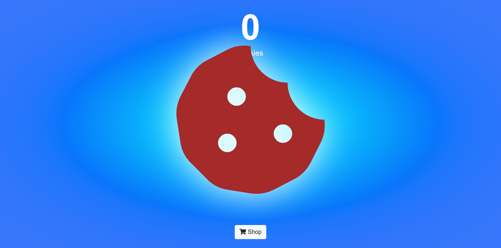
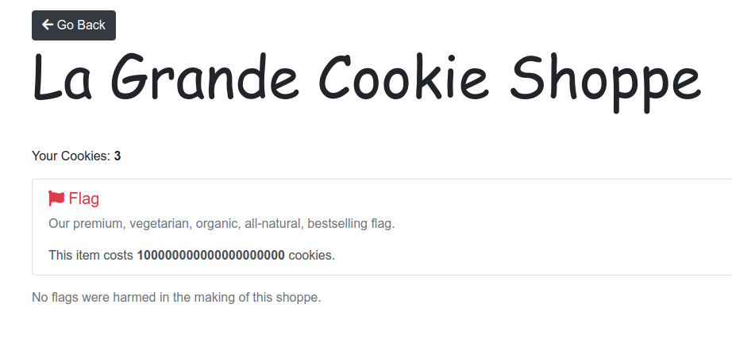
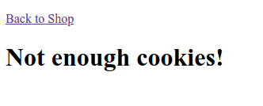
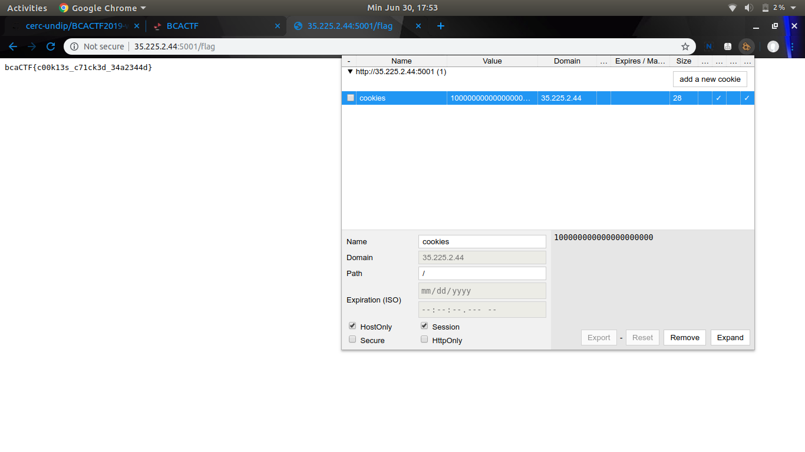

# cookie-clicker
**Category:** web  
**Point:** 150

> My friend built a cookie clicker. How do I beat it?
> 
> http://35.225.2.44:5001/
> 
> Problem submitted by @anli5005

---

Pada challenge kali ini kita diberikan website yang berisi sebuah gambar kue (cookie) yang setiap kali diklik akan langsung memasukkan jumlahnya kedalam cookies yang tersimpan di browser.

Jika kita menekan tombol Shop yang ada di bawah maka kita akan diarahkan ke halaman `/shop` dan memunculkan informasi cookie dan terdapat 1 div yang berisi informasi tambahan untuk mendapatkan flagnya.

Ketika div tersebut ditekan maka akan diarahkan ke halaman `/flag` dan memunculkan informasi bahwa cookie yang dimiliki tidak cukup. Ketika saya kembali ke halaman `/shop` dan mencoba mengubah cookie menggunakan ekstensi [Cookie Editor](https://chrome.google.com/webstore/detail/cookie-editor/hdhngoamekjhmnpenphenpaiindoinpo) pada browser Chrome maka informasi jumlah yang ditampilkan pun akan sesuai dengan yang diisi. Dengan demikian, sudah yakin bahwa website ini dapat diserang menggunakan teknik [Cookie Poisoning](https://searchsecurity.techtarget.com/definition/cookie-poisoning).

Selanjutnya saya coba ubah jumlah cookie menjadi sesuai dengan _item cost_ yang diinginkan dan membuka halaman `/flag`, dan taaddddaaaaaa flag berhasil ditemukan!!!

python exploit : [script.py](./script.py)

flag : `bcaCTF{c00k13s_c71ck3d_34a2344d}`