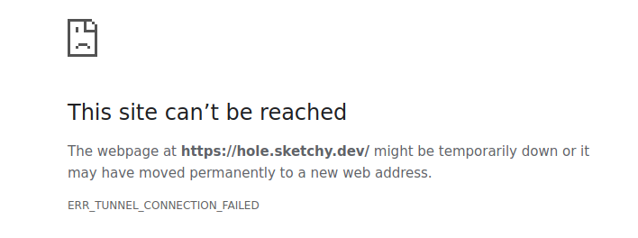
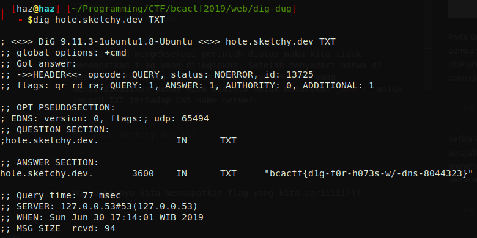

# dig-dug
**Category:** web <br>
**Point:** 100

> I found this super sketchy website called [hole.sketchy.dev](hole.sketchy.dev). Can you help me dig up some of its secrets?
> 
> Oh, and someone told me that the secrets are TXT. I don't know what this means, so good luck!
> 
> Problem submitted by @anli5005

---



Pada saat situs `hole.sketchy.dev` dibuka, maka browser akan menampilkan pesan error bahwa situs tersebut _temporarily down_ atau dipindah permanen. Dari judul memberikan kita clue untuk menggali (**_dig_**) informasi yang ada. Dalam linux juga terdapat command **`dig`**, yaitu command yang berfungsi untuk melakukan query terhadap DNS name server. Untuk membaca lebih lanjut silahkan baca [disini](https://www.tecmint.com/10-linux-dig-domain-information-groper-commands-to-query-dns/).

```bash
dig hole.sketchy.dev
```

Ketika kita mengeksekusi perintah diatas maka kita tidak mendapatkan flag yang diinginkan. Setelah menyadari bahwa di deskripsi ternyata terdapat keterangan **TXT** yang mengindikasikan bahwa kita diminta untuk melakukan _query_ untuk record TXT terhadap DNS name server.

```bash
dig hole.sketchy.dev TXT
```



Dan akhirnya kita mendapatkan flag yang kita cariiiii!!!

exploit : [script.sh](./script.sh)

flag : `bcactf{d1g-f0r-h073s-w/-dns-8044323}`