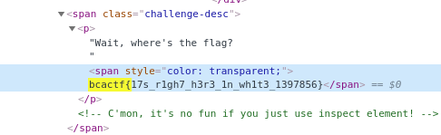

# wite-out
**Category:** web  
**Point:** 50

> Wait, where's the flag?
>
> made by: @anli5005

---

Challenge ini persis dengan challenge sebelumnya yaitu [the-inspector](../the-inspector), kita cukup menggunakan fitur inspect element yang ada pada browser untuk bisa menemukan flag-nya.

Klik challenge `wite-out` sehingga muncul dialog deskripsi, kemudian inspect element dan cari kata kunci flag **"bcactf{"**.

flag : `bcactf{17s_r1gh7_h3r3_1n_wh1t3_1397856}`
